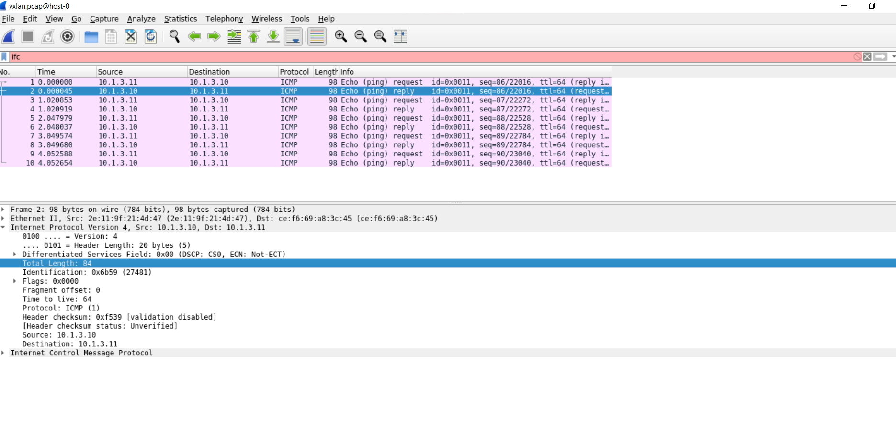
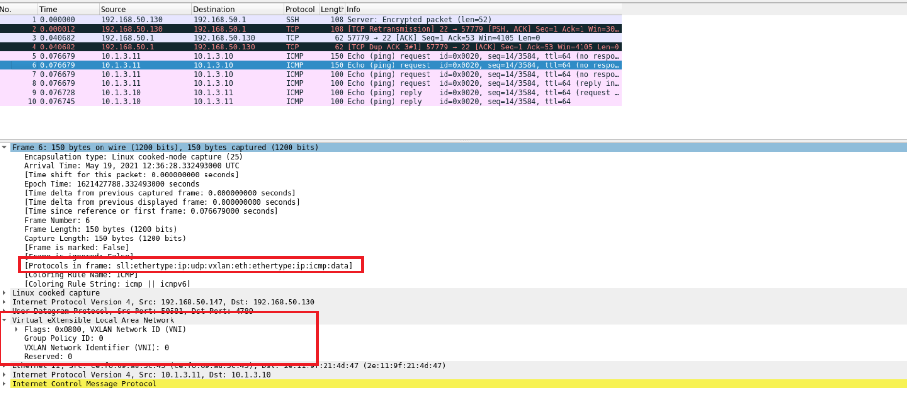

# WEEK-3 PRACTICES DOCUMENTATION
# OPENVSWITCH

---

## **Author:** *Julian (Phong) Ng.* 
**Date of issue**: *May 20th 2021*

> Welcome back! This is the documentation for my second training project at **Viettel Network**. Enjoy ur time :smile_cat:. Feel free to hit me up if any edition is needed!

---
# **Table of Contents:**

## [I. Overview](#**I.-OVERVIEW**)

## [II. Step-by-step](#**II.-STEP-BY-STEP**)

### A. Set Up Environment(#A.-SET-UP-ENVIRONMENT)

### B. Network Configurations (#B.-Network-Configurations):

### C. VXLAN Connectivity between 2 Nodes: (#C.-VXLAN-CONNECTIVITY-BETWEEN-2-NODES)

## [III. Q/A](#III. Q/A)

## [IV. References & Tutorials](#IV.-REFERENCES)

## SET UP
- Network interfaces: `Host-only`

# **I. OVERVIEW**:
## CONCEPTS:
- `Overlay Network`
- VXLAN:
	- Create a phys L2 over IP
	- Establishing connection via `tunnel` -> extends L2 on L3
	- `VTEP`: 
		+ VXLAN Tunnel End Point -> stays on Hypervisor on host of VMs
		+ Can be on switch/ phys server or phys/software


# **II. STEP-BY-STEP**:

## **A. SET UP ENVIRONMENT**:

- Update `apt`:
```
$ sudo apt update
$ sudo apt upgrade
```

- `Must-have` packages via `apt`: `net-tools`, `tcpdump`, `wireshark`
	- `net-tools`: *collection of programs for controlling the network subsystem of the Linux kernel*
	- `tcpdump`: *network packet analyzer*
	- `wireshark`: *network protocol analyzer*
```
$ sudo apt install -y net-tools tcpdump wireshark
```

- Installing `OpenVswitch` (*`virtual switch`*) via `apt`:
```
$ sudo apt install openvswitch-switch
```

- Starting `OpenSwitch`:
```
$ sudo ovs-vswitchd
```

## **B. NETWORK CONFIGURATIONS**:

### Service Functionality & Version check

- Check status of `OpenvSwitch` service:
```
$ systemctl status ovs-vswitchd
```

> **Node 0**


> **Node 1**


- Check version of `OpenvSwitch` service:
```
$ sudo ovs-vsctl --version 
```

### `MUST-KNOW` Networking Diagonistic Commands:

- Check network interfaces:
```
$ sudo ifconfig
```

- Show `routing table`:
```
$ route -n
```

### **1. Host 0**:

- Adding 2 network bridges: `br0`, `br1`

```
$ sudo ovs-vsctl add-br br0
$ sudo ovs-vsctl add-br br1			
```

**Note**
> `br1` should be considered as a dummy interface - **physically not exist**

- Attaching `ens33` to `br0`:
```
$ sudo ovs-vsctl add-port br0 ens33
```

- Disbale `ens33` & Configure IP for `br0`

**Note**
 > At this point, `br0` posseses **IP**, **netmask**, **MAC address** of `ens33`.

```
$ sudo ifconfig ens33 0 && sudo ifconfig br0 192.168.50.130 netmask 255.255.255.0
```

- (Optional) Modify `default gateway` - *Allocated by VMware for mother machine*
```
$ sudo route add default gw 192.168.50.1 br0
```


- Configure IP of `br1`:
```
$ sudo ifconfig br1 10.1.3.10 netmask 255.255.255.0
```

- Configure VXLAN tunnel for `br1`:

```
$ sudo ovs-vsctl add-port br1 vxlan1 -- set interface vxlan1 type=vxlan options:remote_ip=192.168.50.128
```

**Note**:
	- `remote_ip`: **MUST** be address of other node, `host-1`. 

- Full `openvSwitch` configuration on `host-0`:

```
$ sudo ovs-vsctl show
```


### **2. HOST 1**:

- Adding 2 network bridges: `br0`, `br1`

```
$ sudo ovs-vsctl add-br br0
$ sudo ovs-vsctl add-br br1			
```

**Note**
> `br1` should be considered as a dummy interface - **physically not exist**

- Attaching `ens33` to `br0`:
```
$ sudo ovs-vsctl add-port br0 ens33
```

- Disbale `ens33` & Configure IP for `br0`

**Note**
 > At this point, `br0` posseses **IP**, **netmask**, **MAC address** of `ens33`.

```
$ sudo ifconfig ens33 0 && sudo ifconfig br0 192.168.50.128 netmask 255.255.255.0
```

- (Optional) Modify `default gateway` - *Allocated by VMware for mother machine*
```
$ sudo route add default gw 192.168.50.1 br0
```


- Configure IP of `br1`:
```
$ sudo ifconfig br1 10.1.3.11 netmask 255.255.255.0
```

- Configure VXLAN tunnel for `br1`:

```
$ sudo ovs-vsctl add-port br1 vxlan1 -- set interface vxlan1 type=vxlan options:remote_ip=192.168.50.130
```

**Note**:
	- `remote_ip`: **MUST** be address of other node, `host-0`. 

- Full `openvSwitch` configuration on `host-1`:

```
$ sudo ovs-vsctl show
```
**Note**
> Pardon me for the mismatch of `remove_ip` for `vxlan1`. This was changed due to `DHCP`.


## **C. `VXLAN` CONNECTIVITY BETWEEN 2 NODES**:

**Configuration Remark**
	- `host-0`: Reply & Captures request from remote host `host-1`
	- `host-1`: Sends `icmp` echo requests

- Check connection to other node via `VXLAN` with Ping:
	- **Host 0 ----> Host 1**
```
$ ping -I br1 10.1.3.11
```
	- **Host 1 ----> Host 0**
```
$ ping -I br1 10.1.3.10
```

- Captures & Store data packets with `tcpdump`: *Perform these operations simultaneously as described below*
 	- (**Host 1**) Send an ICMP echo request packet:
```
$ ping -I br1 10.1.3.11
```

 	- (**Host 0**) Captures & write data packets to `vxlan.pcap`: 
```
$ sudo tcpdump -i any -c 10 -nn -s 0 -w vxlan.pcap
```
**Options**:
<dl>
    <dt>
      <b>-i</b>
    </dt>
    <dd>
       Selecting interface
    </dd>
    <dt>
      <b>-c</b>
    </dt>
    <dd>
       Restrict the size of the output file to a specific number
    </dd>
    <dt>
      <b>-nn</b>
    </dt>
    <dd>
       Prevent hostname and port resolution (speed up process)
    </dd>
    <dt>
      <b>-w</b>
    </dt>
    <dd>
       Write to file
    </dd>
</dl>


- (**Host 0**) Decapsulate & Analyze packets with `wireshark`:
	1. Start `wireshark` from `Terminal`:
```
$ wireshark
```

> Starting `wireshark`


	
	2. Open `vxlan.pcap` & view detail analysis of packets: 

> Open file on `wireshark` GUI



**Note**
> Interactive GUI of `wireshark` would be automatically starts with above command.

## **C. EXPECTED OUTCOME**:

**Packet is successfully encapuslated with VXLAN header, this `VXLAN` deployment works**



## **III. Q/A Section**:

## **IV. REFERENCES & TUTORIALS**:
- [Configuring VXLAN & GRE Tunnel on openvswitch](http://networkstatic.net/configuring-vxlan-and-gre-tunnels-on-openvswitch/)

- [VXLAN w/ OpenvSwitch](https://github.com/hocchudong/thuctap012017/blob/master/XuanSon/Netowork%20Protocol/VXLAN-GRE%20Protocol.md)

