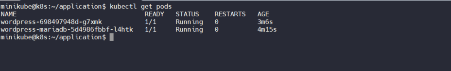
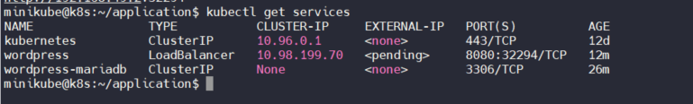
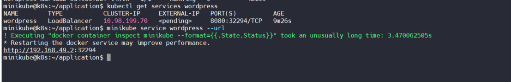

# WEEK-4 PRACTICE DOCUMENTATION
# PaaS - Platform as A Service w/ **`Kubernetes`** :cloud:
---

## **Author:** *Julian (Phong) Ng.* 
**Date of issue**: *May 25th 2021*

> Welcome back! This is the documentation for my second training project at **Viettel Network**. Enjoy ur time :smile_cat:. Feel free to hit me up if any edition is needed!

---

## TABLE OF CONTENTS
### [I. Overview](#I.-OVERVIEW)

### [II. Prerequisite](#II.-PREREQUISITE:)

### [III. Architecture](#III.-ARCHITECTURE)

### [IV. Step-by-step Guide](#IV.-STEP-BY-STEP-GUILD)

### [V. Troubleshooting](#V.-TROUBLESHOOTING)

### [VI. References](#VI.-REFERENCES)


# **I. OVERVIEW:**

## **1. `KUBERNETES`**

### **General Information:**

- **Purposes?** *An open-source system for **automating deployment**, **scaling**, and **orchestration of containerized applications**.*

- **Title `Kubernetes`** - Greek for *"helmsman"* or *"pilot"* :man_pilot:. 

- **Origin?** A `Graduated Project` from `Cloud Native Computing Foundation`. Initially developed by **Google** before donated to `CNCF` in 2014.

- **Core Characteristics**: `portable`, `extensible`, `open-source`.

- **Current Status** *large, rapidly growing ecosystem*. *Available with a range of services, support, and tools.*

- **Release Cycle**: *3-4 months*


### **Terminologies:**

- **`Cluster`**:
	- Collection of `Nodes` combines together

- **`Node`**:
	- Hardware component -> can be either a `VM` or a `Physical machine`.

- **`Pod`**:
	- simplest unit within K8S cluster. 
	- contains one or more container(s).

- **`kubectl`**: CLI of `Kubernetes`


## **2. `MINIKUBE`**:

# **II. PREREQUISITE:**

## **A. Knowledge:**
- Basics on **Linux**, **Networking**. *Sorry for keep repeating this one but these are cores of `Cloud Computing`* :wink:

- Basics on [**Kubernetes**](https://kubernetes.io/docs/home/).
	- Should know basic K8S's CLI `kubectl` commands.
	- Understand `Kubernetes Objects`.

- Basics on [**Docker**](https://docs.docker.com/).
	- Docker's Image & Container Management commands
	- Understand **`Containerization`**.
 

## **B. Infrastructure:**


# **III. ARCHITECTURE:**

## Production-ready Deployment:

## `Minikube` Deployment:
- Showing components of `K8S cluster`

````bash

$ kubectl get pods --namespace kube-system

````

# **IV. STEP-BY-STEP GUIDE** 

**Suggested Directories Layout**

````bash
application/
│
│
│──secrets
│   ├── secret-mariadb.yml
│   └── secret-wordpress.yml
│
│
│──mariadb
│   	└── mariadb-deployment.yml
│
│
└──wordpress
    └── wordpress-deployment.yml

````

## **A. `Minikube`:**

## **1. INSTALL & DEPLOY `Minikube`:**

## **2. Start & Manage `Minikube`:**

- Change user on Linux machine:

````bash
$ su minikube
````

- Start `Minukube`:
```bash
$ minikube start
``` 

- Stop `Minukube`:
```bash
$ minikube stop
``` 

## **B. DEPLOYING `WordPress` & `MariaDB` with `Persistent Volumes`**

### **B1. Create & Manage `Kubernetes` Objects:**

### **1. `Secret`**:
 
**Note**: *All `data` fields in `Secret` should be `base64` encoded*
	- **db_user**: pnguyen
	- **db_name**: wordpress_k8s
	- **db_password**: 12345678

- Encode to `base64`: *Repeat for data fields*
````bash
$ echo "<input>" | base64
````

- Create `secret-mariadb`:
```bash

$ vi secrets/secret-mariadb.yml

----
apiVersion: 1
kind: Secret
metadata:
  name: secret-mariadb
type: Opaque
data:
  db_user: cG5ndXllbgo=
  db_name: d29yZHByZXNzX2s4cw==
  db_password: MTIzNDU2Nzg=
```

- Create `secret-wordpress`:
```bash

$ vi secrets/secret-wordpress.yml

-----
apiVersion: 1
kind: Secret
metadata:
  name: secret-wordpress
type: Opaque
data:
  db_user: cG5ndXllbgo=
  db_name: d29yZHByZXNzX2s4cw==
  db_password: MTIzNDU2Nzg=
```

### **2. `Service`**:

#### **Note**: With each container, `Service`, `Deployment`, `PersistentVolumeClaim` can stored within a single `yaml` file. This deployment includes 2 files:
	- `mariadb-deployment.yml`
	- `wordpress-deployment.yml`

- `Service` for `mariadb`:

```bash

apiVersion: v1
kind: Service
metadata:
  name: wordpress-mariadb
  labels:
    app: wordpress-k8s
spec:
  ports:
    - port: 3306
  selector:
    app: wordpress-k8s
    tier: mariadb
  clusterIP: None

```

- `Service` for `wordpress`:

```bash

apiVersion: v1
kind: Service
metadata:
  name: wordpress
  labels:
    app: wordpress-k8s
spec:
  ports:
    - port: 8080
  selector:
    app: wordpress-k8s
    tier: frontend
  type: LoadBalancer

```

### **3. `PersistentVolumeClaim`**:

- `Volume` for `mariadb`:

```bash

apiVersion: v1
kind: PersistentVolumeClaim
metadata: 
  name: wordpress-mariadb-volume
  labels:
    app: wordpress-k8s
spec:
  accessModes:
    - ReadWriteOnce
  resources:
    requests:
      storage: 2Gi
```


- `Volume` for `wordpress`:

```bash

apiVersion: v1
kind: PersistentVolumeClaim
metadata:
  name: wordpress-volume
  labels:
    app: wordpress
spec:
  accessModes:
    - ReadWriteOnce
  resources:
    requests:
      storage: 2Gi
```

### **4. `Deployment`**:

- `Deployment` for `mariadb`:
```bash

apiVersion: apps/v1
kind: Deployment
metadata:
  name: wordpress-mariadb
  labels:
    app: wordpress-k8s
spec:
  selector: 
    matchLabels:
      app: wordpress-k8s
      tier: mariadb
  strategy:
    type: Recreate
  template:
    metadata:
      labels:
        app: wordpress-k8s
        tier: mariadb
    spec:
      containers:
      - name: mariadb
        image: bitnami/mariadb:latest
        env:
        - name: ALLOW_EMPTY_PASSWORD
          value: yes
        - name: MARIADB_USER
          valueFrom:
            secretKeyRef:
              name: secret-mariadb
              key: db_user
        - name: MARIADB_DATABASE
          valueFrom:
            secretKeyRef:
              name: secret-mariadb
              key: db_name
        - name: MARIADB_PASSWORD
          valueFrom:
            secretKeyRef:
              name: secret-mariadb
              key: db_password
        ports:
        - containerPort: 3306
        name: mariadb
        volumeMounts:
        - name: mariadb-volume
          mountPath: /var/lib/mariadb
      volumes:
      - name: mariadb-volume
        persistentVolumeClaim:
          claimName: wordpress-mariadb-volume
```

- `Deployment` for `wordpress`:

````bash

apiVersion: apps/v1
kind: Deployment
metadata:
  name: wordpress
  labels:
    app: wordpress-k8s
spec:
  selector:
    matchLabels:
      app: wordpress-k8s
      tier: frontend
  strategy:
    type: Recreate
  template:
    metadata:
      labels:
        app: wordpress-k8s
        tier: frontend
    spec:
      containers:
      - name: wordpress
        image: bitnami/wordpress:latest
        env:
          - name: ALLOW_EMPTY_PASSWORD
            value: yes
          - name: WORDPRESS_DATABASE_USER
            valueFrom:
              secretKeyRef:
                name: secret-wordpress
                key: db_user
          - name: WORDPRESS_DATABASE_NAME
            valueFrom:
              secretKeyRef:
                name: secret-wordpress
                key: db_name
          - name: WORDPRESS_DATABASE_PASSWORD
            valueFrom:
              secretKeyRef:
                name: secret-wordpress
                key: db_password
        ports:
        - containerPort: 80
          name: wordpress
        volumeMounts:
        - name: wordpress-storage
          mountPath: /var/www/html
      volumes:
      - name: wordpress-storage
        persistentVolumeClaim:
          claimName: wordpress-volume
````

### **B2. DEPLOY APPLICATIONS WITH `Kubernetes`**:
- Create `mariadb` Secret object:

````bash
$ kubectl apply -f ./secret-mariadb.yml
````


- Create `wordpress` Secret object:

````bash

$ kubectl apply -f ./secret-wordpress.yml

````


- Verify added secrets existence:
````bash

$ kubectl get secrets

````

- Deploy `mariadb`:
````bash

$ kubectl apply -f ./mariadb-deployment.yml

````


- Deploy `wordpress`:
````bash

$ kubectl apply -f ./wordpress-deployment.yml

````


- Check `Pod`(s):

````bash
$  kubectl get pods
````



- Check `Service`:

````bash


$  kubectl get services (<Service-name>)

````

**Note**
> `EXTERNAL-IP` always `<Pending>` because `Minikube` exposes Services through `NodePort` only.





## **C. ACCESS APPLICATION:**
- Check IP of `wordpress`:

```bash

$ minikube service wordpress --url

```




- Visit Landing page:

```bash
$ curl http://<CLUSTER-IP>:<High-PORT>
```


# **V. TROUBLESHOOTING:**

## **`MUST-KNOW` DEBUG COMMANDS**
- Entering a `Container` in K8S with `bash`:
```bash
$ kubectl exec --stdin --tty <Pod-name> -- /bin/bash
```

- View logs:
```bash
$ kubectl logs <pod-name>
```

## 1. `Deployment in version "v1" cannot be handled as a Deployment...`

- Bug detected:
```bash
 env:
        - name: ALLOW_EMPTY_PASSWORD
          value: yes
```

- **Correct**: *Adding quotation marks* 
```bash
 env:
        - name: ALLOW_EMPTY_PASSWORD
          value: "yes"
```

# **VI. REFERENCES:**

- [**kubectl** `apply` or `create`](https://www.digitalocean.com/community/tutorials/imperative-vs-declarative-kubernetes-management-a-digitalocean-comic)

- [Using Secrets](https://kubernetes.io/docs/concepts/configuration/secret/#secret-types)

- [Official Docs Example](https://kubernetes.io/docs/tutorials/stateful-application/mysql-wordpress-persistent-volume/)

